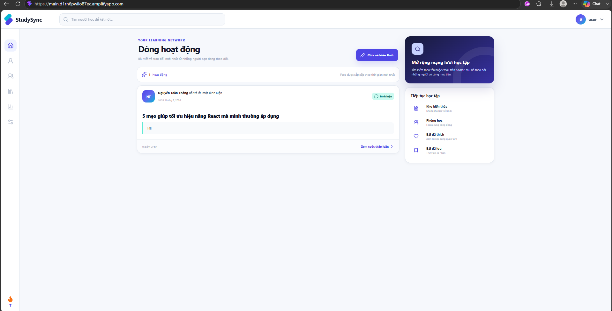
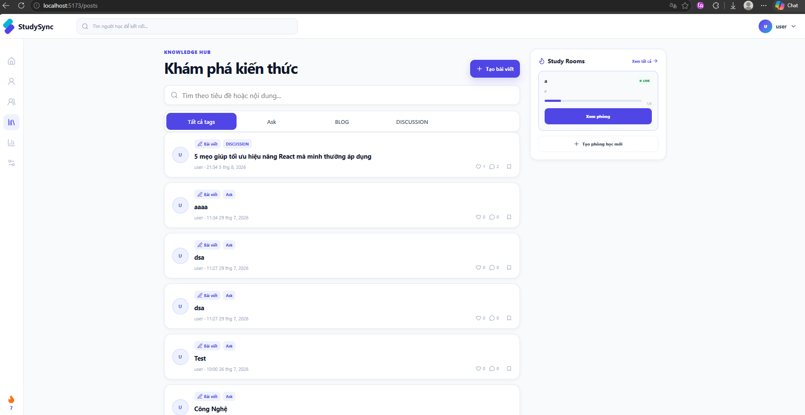
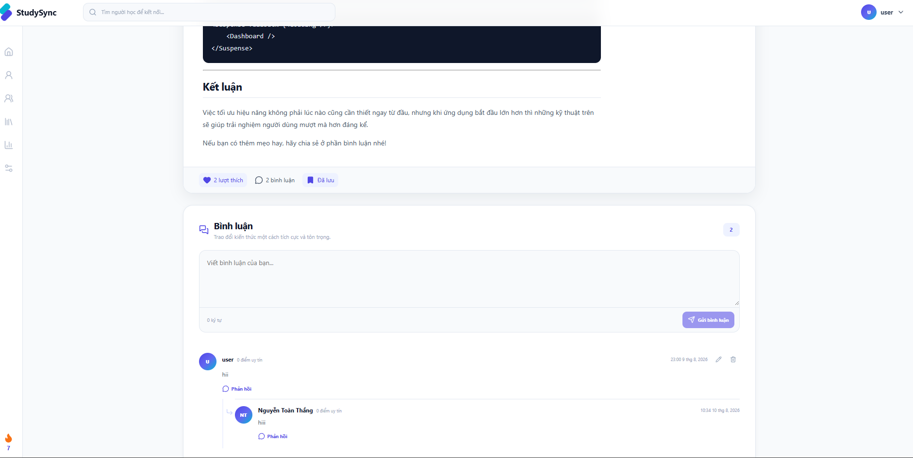
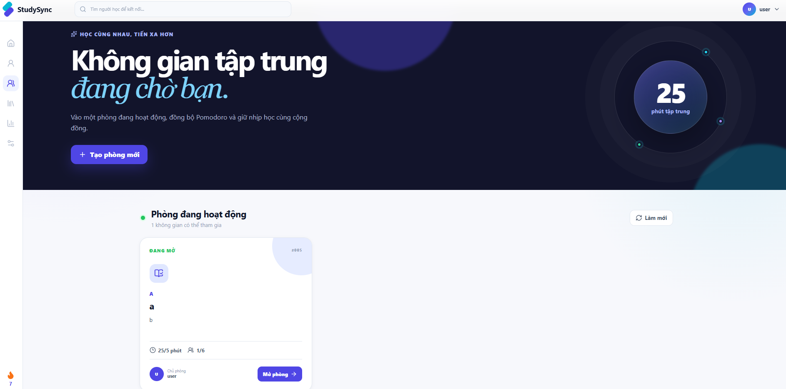
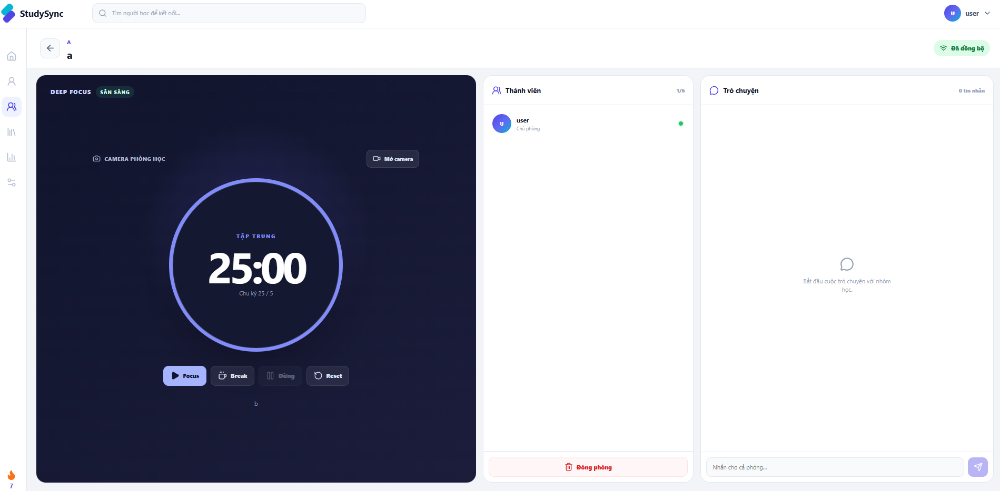
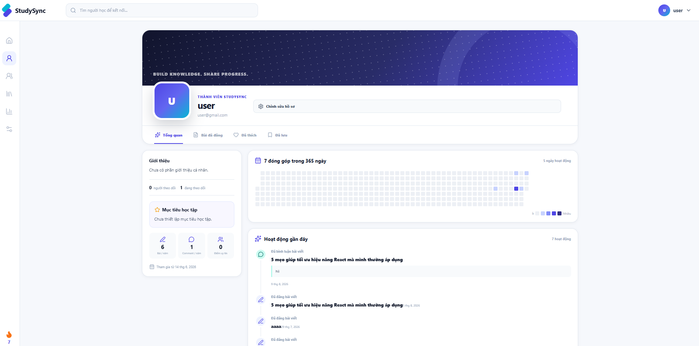
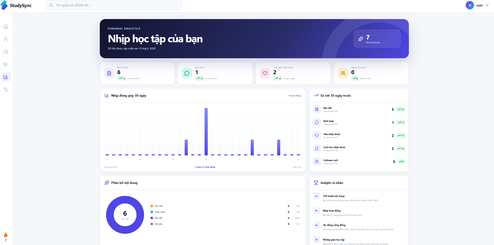
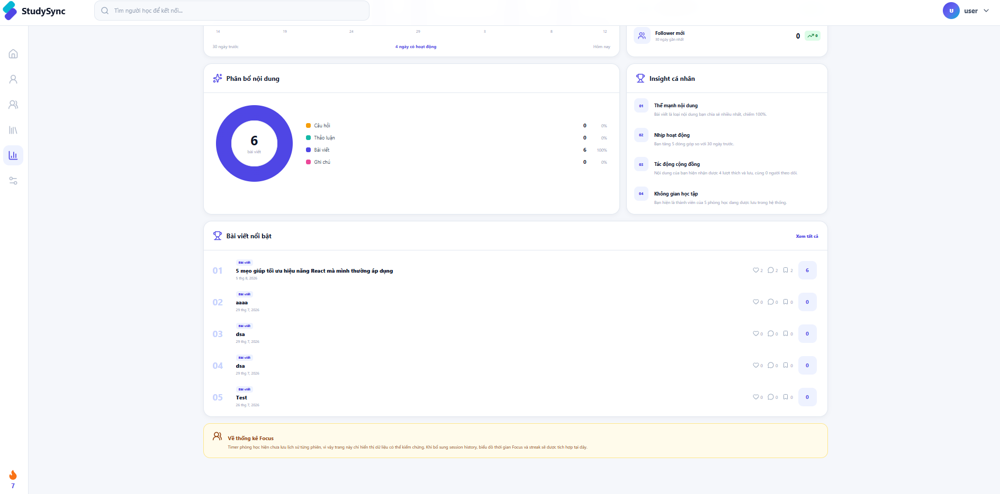

# StudySync

StudySync là nền tảng học tập cộng tác kết hợp mạng xã hội kiến thức, phòng học Pomodoro thời gian thực, video WebRTC, hồ sơ cá nhân kiểu GitHub và thống kê hoạt động học tập.

Ứng dụng giúp người dùng tìm bạn học, theo dõi hoạt động của nhau, chia sẻ bài viết, thảo luận và cùng duy trì nhịp tập trung trong các Study Room.

## Live Demo

[Mở StudySync trên AWS Amplify](https://main.d1rn6pwilo87ec.amplifyapp.com)

## Tính năng chính

### Mạng xã hội học tập

- Tìm người dùng theo tên hoặc email ngay trên navbar.
- Theo dõi và bỏ theo dõi người dùng.
- Xem hồ sơ, follower và danh sách đang theo dõi.
- Home feed hiển thị bài đăng và bình luận mới nhất từ những người đang theo dõi.
- Feed có phân trang và tự cập nhật sau khi thay đổi follow.

### Knowledge Hub

- Đăng bài viết, câu hỏi, thảo luận và ghi chú.
- Tìm kiếm nội dung và lọc theo tag.
- Like, lưu bài viết và xem danh sách nội dung cá nhân.
- Bình luận, trả lời bình luận, chỉnh sửa và xóa bình luận.
- Hỗ trợ Markdown và upload tài liệu lên AWS S3.

### Study Room

- Tạo, tham gia, rời và đóng phòng học.
- Pomodoro đồng bộ giữa tất cả thành viên bằng STOMP WebSocket.
- Tự động chuyển từ Focus sang Break khi hết giờ.
- Phát âm thanh thông báo khi kết thúc phiên.
- Trò chuyện thời gian thực trong phòng.
- Camera nhiều người bằng WebRTC.
- Giao diện camera-first hỗ trợ tối đa 10 video trong lưới responsive.

### Hồ sơ cá nhân

- Hồ sơ cá nhân và hồ sơ công khai của người dùng.
- Contribution heatmap 365 ngày từ lịch sử đăng bài và bình luận.
- Timeline hoạt động gần đây.
- Các tab bài đã đăng, đã thích và đã lưu.
- Xem danh sách follower/following và mở profile chi tiết.

### Thống kê cá nhân

- Tổng bài viết, bình luận, lượt thích, lượt lưu và follower.
- So sánh 30 ngày gần nhất với 30 ngày trước.
- Biểu đồ đóng góp 30 ngày.
- Phân bổ loại nội dung.
- Top bài viết theo tổng tương tác.
- Insight tự động về nhịp hoạt động và tác động cộng đồng.

## Screenshots

### Social Feed



### Knowledge Hub



### Post Detail & Comments



### Study Room Directory



### Pomodoro Study Room



### Personal Profile



### Personal Statistics





## Công nghệ sử dụng

### Frontend

- React 19
- TypeScript 6
- Vite 8
- React Router 7
- Axios
- STOMP.js
- WebRTC API
- React Markdown + Remark GFM
- Lucide React
- Oxlint

### Backend

- Java 17
- Spring Boot 4
- Spring Security
- OAuth2 Resource Server và JWT
- Spring Data JPA
- Spring WebSocket + STOMP
- PostgreSQL
- Bean Validation
- Springdoc OpenAPI / Swagger UI
- AWS SDK for Java + Amazon S3
- Maven

### Hạ tầng

- AWS Amplify cho frontend
- Docker và Docker Compose cho backend
- PostgreSQL / Neon PostgreSQL
- AWS S3 cho tài liệu tải lên

## Kiến trúc tổng quan

```text
Browser
  |
  |-- HTTPS / REST ----------------------> Spring Boot API
  |                                         |-- PostgreSQL
  |                                         |-- AWS S3
  |
  |-- WebSocket / STOMP -----------------> Study Room realtime
  |
  |-- WebRTC peer-to-peer ---------------> Camera giữa thành viên
         signaling đi qua STOMP
```

Backend chịu trách nhiệm xác thực, dữ liệu nghiệp vụ, WebSocket signaling và phân quyền. Video WebRTC được truyền trực tiếp giữa các trình duyệt, không đi qua Spring Boot.

## Cấu trúc repository

```text
StudySync/
|-- FrontEnd/                  # React + TypeScript + Vite
|   |-- src/
|   |   |-- components/
|   |   |-- contexts/
|   |   |-- hooks/
|   |   |-- pages/
|   |   |-- services/
|   |   |-- styles/
|   |   |-- types/
|   |   `-- assets/            # Screenshots và notification sound
|   |-- .env.example
|   `-- package.json
|-- StudySync/                 # Spring Boot backend
|   |-- src/main/java/
|   |-- src/main/resources/
|   |-- .env.example
|   |-- Dockerfile
|   |-- docker-compose.yml
|   `-- pom.xml
|-- amplify.yml
`-- README.md
```

## Yêu cầu môi trường

- Node.js 20 trở lên
- npm 10 trở lên
- Java 17 trở lên
- PostgreSQL
- Docker Desktop nếu chạy backend bằng container
- AWS S3 bucket nếu sử dụng upload tài liệu trên production

Camera trình duyệt yêu cầu HTTPS trên production. `localhost` được trình duyệt xem là secure context khi phát triển local.

## Chạy ứng dụng local

### 1. Clone repository

```bash
git clone <repository-url>
cd StudySync
```

### 2. Cấu hình backend

Tạo file `StudySync/.env` dựa trên `StudySync/.env.example`:

```env
DB_HOST=localhost:5432
DB_NAME=studysync
DB_USER=postgres
DB_PASSWORD=your_password

JWT_SECRET=your_base64_encoded_secret
JWT_ACCESS_TOKEN_VALIDITY_SECONDS=3600
JWT_REFRESH_TOKEN_VALIDITY_SECONDS=604800

STUDYSYNC_ALLOWED_ORIGIN=http://localhost:5173
SPRING_JPA_HIBERNATE_DDL_AUTO=update
SPRINGDOC_ENABLED=true

AWS_REGION=ap-southeast-1
AWS_S3_BUCKET=
AWS_S3_KEY_PREFIX=documents
AWS_S3_PRESIGNED_URL_MINUTES=15
```

`JWT_SECRET` phải là một chuỗi Base64 đủ mạnh. Không commit file `.env` hoặc khóa AWS vào repository.

Nếu PostgreSQL local không sử dụng SSL, có thể cấu hình trực tiếp:

```env
SPRING_DATASOURCE_URL=jdbc:postgresql://localhost:5432/studysync
SPRING_DATASOURCE_USERNAME=postgres
SPRING_DATASOURCE_PASSWORD=your_password
```

Chạy backend trên Windows:

```powershell
cd StudySync
.\mvnw.cmd spring-boot:run
```

Linux hoặc macOS:

```bash
cd StudySync
./mvnw spring-boot:run
```

Backend mặc định chạy tại `http://localhost:8080`.

### 3. Cấu hình frontend

Tạo file `FrontEnd/.env` dựa trên `FrontEnd/.env.example`:

```env
VITE_API_URL=http://localhost:8080
```

Cài đặt và chạy frontend:

```bash
cd FrontEnd
npm install
npm run dev
```

Frontend mặc định chạy tại `http://localhost:5173`.

## Chạy backend bằng Docker

Chuẩn bị `StudySync/.env`, sau đó chạy:

```bash
cd StudySync
docker compose up --build
```

Container backend được bind mặc định vào `127.0.0.1:8080`. Có thể thay đổi bằng `BACKEND_BIND_ADDRESS` trong `.env`.

## Lệnh phát triển

### Frontend

```bash
cd FrontEnd
npm run dev
npm run lint
npm run build
npm run preview
```

### Backend

Windows:

```powershell
cd StudySync
.\mvnw.cmd compile
.\mvnw.cmd test
.\mvnw.cmd clean verify
```

Linux hoặc macOS:

```bash
cd StudySync
./mvnw compile
./mvnw test
./mvnw clean verify
```

## API và tài liệu

Khi `SPRINGDOC_ENABLED=true`:

- Swagger UI: `http://localhost:8080/swagger-ui/index.html`
- OpenAPI JSON: `http://localhost:8080/v3/api-docs`
- Health check: `http://localhost:8080/actuator/health`

Các nhóm API chính:

```text
/api/v1/auth           Authentication
/api/v1/users          Profile, search, contributions, statistics
/api/v1/posts          Knowledge Hub và personal post lists
/api/v1/comments       Comments và comment activity
/api/v1/follows        Follow graph và social feed
/api/v1/study-rooms    Study Room REST API
/api/v1/tags           Post tags
/ws                    STOMP WebSocket endpoint
```

## Realtime và WebRTC

- Client kết nối STOMP tới `/ws` bằng JWT trong header `Authorization`.
- Thành viên subscribe `/topic/study-rooms/{roomId}`.
- Chat, Pomodoro và WebRTC signaling dùng các destination `/app/study-rooms/{roomId}/...`.
- Server xác minh thành viên trước khi cho subscribe hoặc gửi signaling.
- Camera không tự bật; người dùng phải chủ động cấp quyền.
- Phiên bản hiện tại chỉ truyền video, chưa bật microphone.

WebRTC hiện dùng STUN công cộng. Để kết nối ổn định trên mobile, corporate network hoặc NAT phức tạp, production nên cấu hình TURN server với credential ngắn hạn.

## Bảo mật

- API cá nhân được bảo vệ bằng JWT.
- WebSocket xác thực token ngay trong STOMP `CONNECT` frame.
- Người gửi WebRTC được xác định từ JWT, không tin `fromUserId` từ client.
- SDP và ICE candidate có giới hạn kích thước ở backend.
- Secrets phải được truyền qua environment variables.
- Không commit `.env`, database password, JWT secret hoặc AWS access key.

## Giới hạn hiện tại

- Thống kê Focus chưa có tổng thời gian học và streak chính xác vì hệ thống chưa lưu lịch sử từng phiên timer.
- WebRTC mesh phù hợp phòng nhỏ; nếu cần hàng chục camera đồng thời nên chuyển sang SFU.
- TURN server chưa được tích hợp vào cấu hình production.
- Dữ liệu like, bookmark và follow phản ánh trạng thái hiện tại; thao tác đã xóa không còn trong lịch sử thống kê.
- Test tự động hiện chủ yếu kiểm tra Spring application context; cần mở rộng test cho repository, service và WebSocket/WebRTC signaling.

## Hướng phát triển

- Lưu `StudySession` để thống kê Focus time, streak và mục tiêu tuần.
- Bổ sung microphone, mute control và lựa chọn thiết bị media.
- Dùng TURN credential service hoặc SFU cho video production.
- Notification realtime cho follow, like, comment và reply.
- Cursor pagination cho social feed.
- Mở rộng integration test và end-to-end test.

## License

Dự án hiện chưa khai báo giấy phép nguồn mở. Thêm file `LICENSE` trước khi phân phối hoặc cho phép tái sử dụng công khai.
